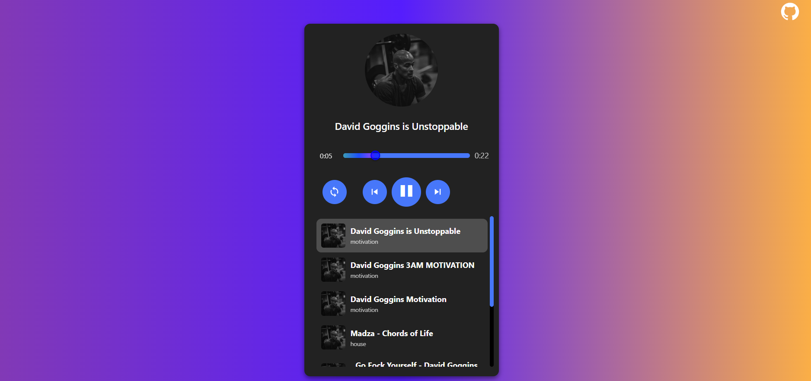

# A minimalist music player developed with React.




## Installation

1. Clone the repository:

   ```sh
   git clone https://github.com/rojas-oscar/music-player
   ```

2. Install the dependencies:

   ```sh
   npm install
   ```

3. Run the project:

   ```sh
   npm run dev
   ```

4. Open your browser and navigate to:

   ```text
   http://localhost:5173
   ```
